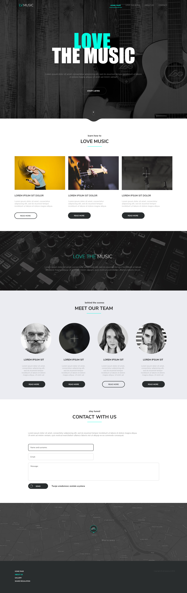

Projekt zrealizowany na warsztatach CodersLab, podczas których wykonałem
loyaut strony internetowej typu "One page site". Celem w/w warsztatu było utrwalenie 
zdobytej podczas kursu wiedzy.

Wykorzystane technologie: 

-Html 

-Css 

-JavaScript. 

Do automatyzacji pracy został wykorzystany Gulp i Sass.

